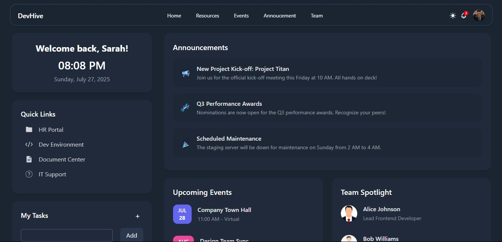

# DevHive -- Office Culture Dashboard UI

*This is a submission for [Frontend Challenge: Office Edition sponsored by Axero, Holistic Webdev: Office Space](https://dev.to/challenges/frontend/axero)*

> An intranet-style dashboard inspired by a developer's daily workflow, created using **React.js** and **Tailwind CSS**.

## Inspiration

The prompt for this challenge was to **design a dream intranet homepage** that reflects digital office culture. I chose to build a modern, welcoming, and functional dashboard, something a developer might see first thing in the morning when starting work.

This dashboard includes real-time feel widgets like:

* A warm greeting with live time & date
* Quick access links (Dev Environment, HR, IT Support)
* Company-wide announcements
* Task list management
* Upcoming events
* Team spotlight to recognize key team members

The UI is minimal yet informative, just what you need to start your day at DevHive!

## Tech Stack

* React.js - Component-based structure for dynamic UI
* Tailwind CSS - Utility-first styling for fast and responsive design
* Vite - Lightning-fast development environment

## Features

* Dynamic time & date display
* Announcements section
* Task manager with add/delete functionality
* Quick Links panel
* Spotlighted team members
* Event preview cards with icons and categories
* Smooth transitions and responsive layout
* Dark Theme - Modern and gentle on the eyes, suitable for long work sessions

## Preview



## Getting Started

1. Clone the repo:

```bash
git clone https://github.com/dipanshu447/company-intranet-ui.git
cd company-intranet-ui
```

2. Install dependencies:

```bash
npm install
```

3. Run the development server:

```bash
npm run dev
```

## Author

Made with 💙 by **Dipanshu Sahu**

* [GitHub](https://github.com/dipanshu447)
* [Dev.to](https://dev.to/dipanshu447)

## License

This project is open source and free to use under the [MIT License](LICENSE).